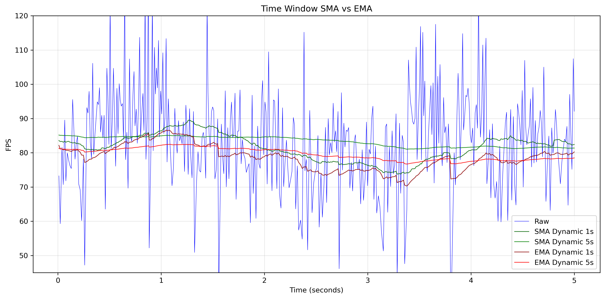
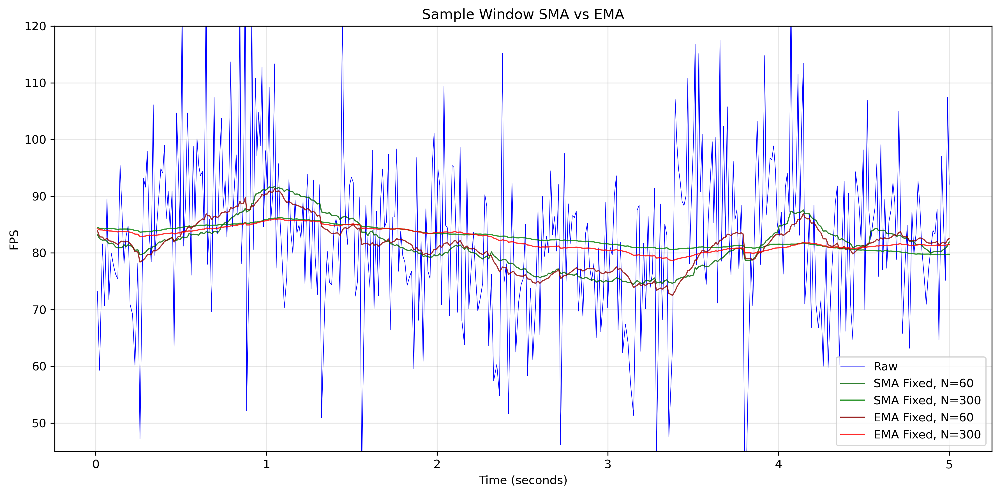

I recently read [this article](https://vplesko.com/posts/how_to_implement_an_fps_counter.html) about implementing FPS counters which looks at a few different methods, covering the benefits and drawbacks; while interesting, it focuses exclusively on the use of simple moving averages (SMA). I'm not a game developer, but I've done enough graphical programming that I've encountered this problem a number of times and instead tend to opt for [exponential moving average (EMA)](https://en.wikipedia.org/wiki/Exponential_smoothing), which I haven't seen discussed much online for this use case.

I'm not going to explain EMA (because I'd just be rephrasing the first paragraph of Wikipedia) or analyze the tradeoffs from a signal processing perspective. I don't have much experience in that field, and I'm more interested in its applications to software engineering. The plain and simple reason for preferring EMA is that it has constant time and space complexity regardless of window size, while also being easier to implement, in my opinion. These properties make it an interesting technique for low-overhead moving average calculations on just about any real-time metric.

For our application, we will be keeping track of the moving average of frame duration which we denote $\bar{d}_i$. Our smoothed frames per second that we display to the screen as a counter is trivially calculated as $1/\bar{d}_i$. We let $d_i$ be the duration of the current frame and $\bar{d}_{i-1}$ be the moving average after the previous frame. So the formula is:

$$\bar{d_i} = \alpha d_i + (1-\alpha)\bar{d}_{i-1}$$


## Fixed Smoothing Factor

The most important thing to figure out is what value we use for $\alpha$, which can be thought of as the smoothing or forgetting factor. When using EMA on stocks it is common to see visualizations of n-day EMA. The way they figure out $\alpha$ for this financial calculation relies on the concept of the average age of datapoints. For an SMA with a fixed sample window, the average age of datapoints is simply $n/2$. For fixed frequency EMA, the average age of its datapoints is $(1-\alpha)/\alpha$. By setting these two as equal, we derive a formula for $\alpha$, whereby the EMA smoothing approximates the smoothing of an n-sample SMA:

$$
\alpha=\frac{2}{n+1}
$$

This can be used as is for a quick and dirty FPS counter if you just want the average over last n frames. However, as discussed in the original post, the problem with using fixed sample averages for FPS is that it doesn't properly depend on time. This is especially noticeable when graphing the values over time: a slower framerate will be smoother, while a high framerate will be more jittery.

## Time-based (Dynamic) Smoothing Factor

What we actually want is the average framerate over the last $T$ duration in some time unit. To do this we will consider that we want our EMA to maintain a constant average age of datapoints $T$, therefore:

$$T = \alpha (0) + (1-\alpha)(T + d_i)$$
$$\alpha = \frac{d_i}{T + d_i}$$

Substituting this into our original formula we get:

$$\bar{d_i} = \frac{d_i}{T + d_i} d_i + (1-\frac{d_i}{T + d_i})\bar{d}_{i-1}$$

And after some simplification:

$$\bar{d}_i = \frac{d_i^2 + \bar{d}_{i-1}T}{T+d_i}$$

So if we want to approximate the smoothing of a duration based SMA like the method arrived at in the original blog, we set $T$ to the SMA window duration divided by two because the average age of time windowed SMA data is simply half the window duration.

## Real World Analysis

I took a random capture of 5 seconds of ARC Raiders gameplace with CapFrameX then implemented assorted smoothing techniques to demonstrate the resulting FPS values.

<a href="../resources/time_fps_graph.png" target="_blank">
  
</a>

<a href="../resources/sample_fps_graph.png" target="_blank">
  
</a>

[notebook source](https://github.com/wilgaboury/blog/blob/master/other/fps-analysis/frame_analysis.ipynb)

## FPS Calculation Routine Using SDL

Provided is example C code for using this technique with the popular [SDL library](https://www.libsdl.org/).

```C
void update_ema_frame_duration_sec(
    Uint64 *prev_frame_start,
    float *ema_dur,
    float window_dur
) {
    Uint64 frame_start = SDL_GetPerformanceCounter();
    float frame_dur_unitless = (float)(frame_start-*prev_frame_start);
    *prev_frame_start = frame_start;
    float frame_dur = frame_dur_unitless/(float)SDL_GetPerformanceFrequence();
    float t = window_dur/2.0f;
    *ema_dur = (frame_dur*frame_dur + *ema_dur*t)/(t+frame_dur);
}
```